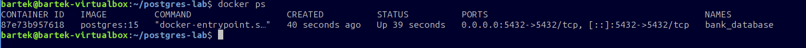
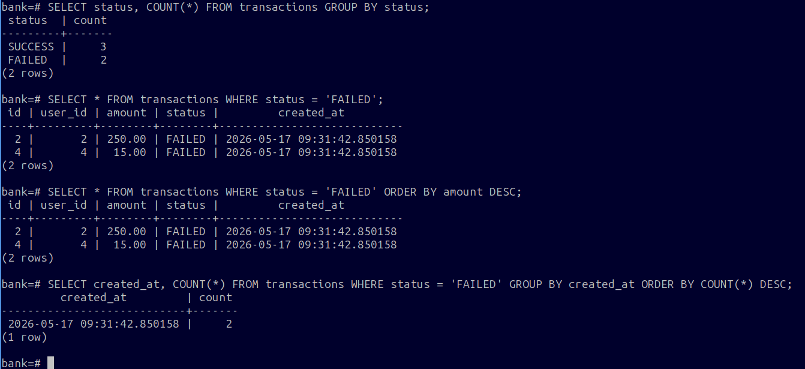

# PostgreSQL Incident Lab

Projekt symuluje awarię systemu transakcyjnego w banku oraz przedstawia proces analizy problemu przy użyciu bazy danych PostgreSQL uruchomionej w kontenerze Docker.

## Jak uruchomić to środowisko?

1. Stwórz folder na ten projekt i przejdź do niego:
   mkdir ~/postgres-lab && cd ~/postgres-lab
   
2. Pobierz plik docker-compose.yml z repozytorium lub przygotuj go samemu i zapisz w folderze wcześniej utworzonym. Jest to plik konfiguracyjny dockera który mówi mu, aby pobrał bazę PostgresSQL i ją uruchomił.
   
3. Uruchamiamy dockera:
   docker compose up -d
   
   Możemy sprawdzić czy się uruchomił wpisując polecenie:
   docker ps
   
4. Wchodzimy do konsoli PostgreSQL wewnątrz kontenera:
   docker exec -oit bank_database psql -U admin -d bank
   
5. Wpisujemy polecenia z pliku init.sql, które tworzą tabele, dodają dane i analizują incydent.

## Przebieg wdrożenie i analizy incydentu

### 1. Uruchomienie środowiska bazodanowego
Weryfikacja stanu kontera aplikacyjnego za pomocą narzędzia Docker.

---

### 2. Analiza bazy danych pod kątem anomalii transakcyjnych
Pełna ścieżka diagnostyczna wykonana bezpośrednio w konsoli PostgreSQL (`psql`).

W toku śledztwa wykonano:
* **Statystykę awarii:** Agregację danych wskazującą na wystąpienie 2 transakcji zakończonych błędem (`FAILED`).
* **Identyfikację błędów:** Wyciągnięcie szczegółów uszkodzonych rekordów w celu analizy dotkniętych kont użytkowników.
* **Priorytetyzację:** Sortowanie nieudanych transakcji po kwotach (wybór najwyższych wolumenów finansowych do natychmiastowej obsługi).
* **Analizę osi czasu:** Zgrupowanie błędów po znaczniku czasu wraz z sortowaniem do momentu o najwyższym nasileniu awarii (wyznaczenie punktu kulminacyjnego incydentu).

